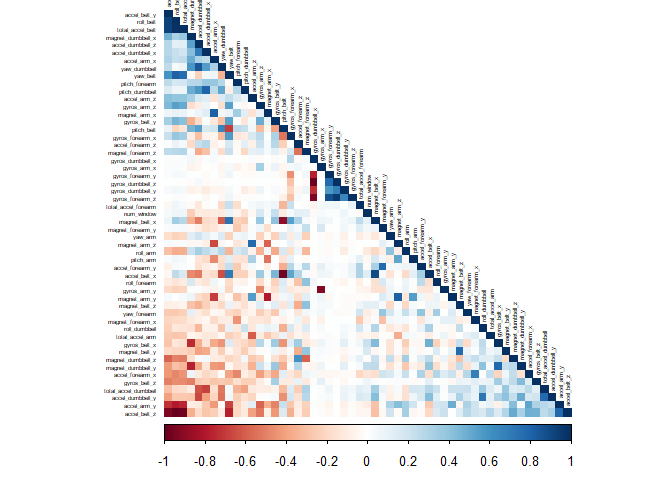
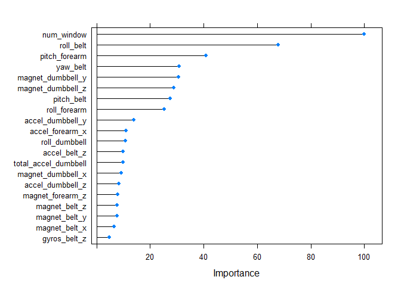

# Pratical Machine Learning Assignment
Using devices such as Jawbone Up, Nike FuelBand, and Fitbit it is now possible to collect a large amount of data about personal activity relatively inexpensively. These type of devices are part of the quantified self movement - a group of enthusiasts who take measurements about themselves regularly to improve their health, to find patterns in their behavior, or because they are tech geeks. One thing that people regularly do is quantify how much of a particular activity they do, but they rarely quantify how well they do it. In this project, your goal will be to use data from accelerometers on the belt, forearm, arm, and dumbell of 6 participants. They were asked to perform barbell lifts correctly and incorrectly in 5 different ways. More information is available from the website here: http://web.archive.org/web/20161224072740/http:/groupware.les.inf.puc-rio.br/har (see the section on the Weight Lifting Exercise Dataset).


# Summary
This document explores the training dataset given. Three machine learning models are compared and evaluated in term of accurancy for predicting the class of the exercise.

Random tree forest seems the best choice in this case with 0.9963 accuracy compared to Decision Tree : 0.7368 GBM : 0.9839.


## Data

The training data for this project are available here:

https://d396qusza40orc.cloudfront.net/predmachlearn/pml-training.csv

The test data are available here:

https://d396qusza40orc.cloudfront.net/predmachlearn/pml-testing.csv

The data for this project come from this source: http://web.archive.org/web/20161224072740/http:/groupware.les.inf.puc-rio.br/har. If you use the document you create for this class for any purpose please cite them as they have been very generous in allowing their data to be used for this kind of assignment.


#Loading the datasets
We import the datasets and from the Training dataset we create a train/test partition with outcome variable "classe".


```r
train<-read.csv("pml-training.csv",na.strings=c("NA","#DIV/0!"))
test<-read.csv("pml-testing.csv",na.strings=c("NA","#DIV/0!"))
inTrain  <- createDataPartition(train$classe, p=0.7, list=FALSE)
TrainSet <- train[inTrain, ]
TestSet  <- train[-inTrain, ]
```

# Exploratory Data Analysis
Let's check the TrainSet directly. Exploring this dataset saves a bit of execution time since it is 70% of the original one.
On the top of str command we find the number of observations and variables.

```r
str(TrainSet)
```

```
## 'data.frame':	13737 obs. of  160 variables:
##  $ X                       : int  2 3 6 7 8 9 11 12 13 15 ...
##  $ user_name               : Factor w/ 6 levels "adelmo","carlitos",..: 2 2 2 2 2 2 2 2 2 2 ...
##  $ raw_timestamp_part_1    : int  1323084231 1323084231 1323084232 1323084232 1323084232 1323084232 1323084232 1323084232 1323084232 1323084232 ...
##  $ raw_timestamp_part_2    : int  808298 820366 304277 368296 440390 484323 500302 528316 560359 604281 ...
##  $ cvtd_timestamp          : Factor w/ 20 levels "02/12/2011 13:32",..: 9 9 9 9 9 9 9 9 9 9 ...
##  $ new_window              : Factor w/ 2 levels "no","yes": 1 1 1 1 1 1 1 1 1 1 ...
##  $ num_window              : int  11 11 12 12 12 12 12 12 12 12 ...
##  $ roll_belt               : num  1.41 1.42 1.45 1.42 1.42 1.43 1.45 1.43 1.42 1.45 ...
##  $ pitch_belt              : num  8.07 8.07 8.06 8.09 8.13 8.16 8.18 8.18 8.2 8.2 ...
##  $ yaw_belt                : num  -94.4 -94.4 -94.4 -94.4 -94.4 -94.4 -94.4 -94.4 -94.4 -94.4 ...
##  $ total_accel_belt        : int  3 3 3 3 3 3 3 3 3 3 ...
##  $ kurtosis_roll_belt      : num  NA NA NA NA NA NA NA NA NA NA ...
##  $ kurtosis_picth_belt     : num  NA NA NA NA NA NA NA NA NA NA ...
##  $ kurtosis_yaw_belt       : logi  NA NA NA NA NA NA ...
##  $ skewness_roll_belt      : num  NA NA NA NA NA NA NA NA NA NA ...
##  $ skewness_roll_belt.1    : num  NA NA NA NA NA NA NA NA NA NA ...
##  $ skewness_yaw_belt       : logi  NA NA NA NA NA NA ...
##  $ max_roll_belt           : num  NA NA NA NA NA NA NA NA NA NA ...
##  $ max_picth_belt          : int  NA NA NA NA NA NA NA NA NA NA ...
##  $ max_yaw_belt            : num  NA NA NA NA NA NA NA NA NA NA ...
##  $ min_roll_belt           : num  NA NA NA NA NA NA NA NA NA NA ...
##  $ min_pitch_belt          : int  NA NA NA NA NA NA NA NA NA NA ...
##  $ min_yaw_belt            : num  NA NA NA NA NA NA NA NA NA NA ...
##  $ amplitude_roll_belt     : num  NA NA NA NA NA NA NA NA NA NA ...
##  $ amplitude_pitch_belt    : int  NA NA NA NA NA NA NA NA NA NA ...
##  $ amplitude_yaw_belt      : num  NA NA NA NA NA NA NA NA NA NA ...
##  $ var_total_accel_belt    : num  NA NA NA NA NA NA NA NA NA NA ...
##  $ avg_roll_belt           : num  NA NA NA NA NA NA NA NA NA NA ...
##  $ stddev_roll_belt        : num  NA NA NA NA NA NA NA NA NA NA ...
##  $ var_roll_belt           : num  NA NA NA NA NA NA NA NA NA NA ...
##  $ avg_pitch_belt          : num  NA NA NA NA NA NA NA NA NA NA ...
##  $ stddev_pitch_belt       : num  NA NA NA NA NA NA NA NA NA NA ...
##  $ var_pitch_belt          : num  NA NA NA NA NA NA NA NA NA NA ...
##  $ avg_yaw_belt            : num  NA NA NA NA NA NA NA NA NA NA ...
##  $ stddev_yaw_belt         : num  NA NA NA NA NA NA NA NA NA NA ...
##  $ var_yaw_belt            : num  NA NA NA NA NA NA NA NA NA NA ...
##  $ gyros_belt_x            : num  0.02 0 0.02 0.02 0.02 0.02 0.03 0.02 0.02 0 ...
##  $ gyros_belt_y            : num  0 0 0 0 0 0 0 0 0 0 ...
##  $ gyros_belt_z            : num  -0.02 -0.02 -0.02 -0.02 -0.02 -0.02 -0.02 -0.02 0 0 ...
##  $ accel_belt_x            : int  -22 -20 -21 -22 -22 -20 -21 -22 -22 -21 ...
##  $ accel_belt_y            : int  4 5 4 3 4 2 2 2 4 2 ...
##  $ accel_belt_z            : int  22 23 21 21 21 24 23 23 21 22 ...
##  $ magnet_belt_x           : int  -7 -2 0 -4 -2 1 -5 -2 -3 -1 ...
##  $ magnet_belt_y           : int  608 600 603 599 603 602 596 602 606 597 ...
##  $ magnet_belt_z           : int  -311 -305 -312 -311 -313 -312 -317 -319 -309 -310 ...
##  $ roll_arm                : num  -128 -128 -128 -128 -128 -128 -128 -128 -128 -129 ...
##  $ pitch_arm               : num  22.5 22.5 22 21.9 21.8 21.7 21.5 21.5 21.4 21.4 ...
##  $ yaw_arm                 : num  -161 -161 -161 -161 -161 -161 -161 -161 -161 -161 ...
##  $ total_accel_arm         : int  34 34 34 34 34 34 34 34 34 34 ...
##  $ var_accel_arm           : num  NA NA NA NA NA NA NA NA NA NA ...
##  $ avg_roll_arm            : num  NA NA NA NA NA NA NA NA NA NA ...
##  $ stddev_roll_arm         : num  NA NA NA NA NA NA NA NA NA NA ...
##  $ var_roll_arm            : num  NA NA NA NA NA NA NA NA NA NA ...
##  $ avg_pitch_arm           : num  NA NA NA NA NA NA NA NA NA NA ...
##  $ stddev_pitch_arm        : num  NA NA NA NA NA NA NA NA NA NA ...
##  $ var_pitch_arm           : num  NA NA NA NA NA NA NA NA NA NA ...
##  $ avg_yaw_arm             : num  NA NA NA NA NA NA NA NA NA NA ...
##  $ stddev_yaw_arm          : num  NA NA NA NA NA NA NA NA NA NA ...
##  $ var_yaw_arm             : num  NA NA NA NA NA NA NA NA NA NA ...
##  $ gyros_arm_x             : num  0.02 0.02 0.02 0 0.02 0.02 0.02 0.02 0.02 0.02 ...
##  $ gyros_arm_y             : num  -0.02 -0.02 -0.03 -0.03 -0.02 -0.03 -0.03 -0.03 -0.02 0 ...
##  $ gyros_arm_z             : num  -0.02 -0.02 0 0 0 -0.02 0 0 -0.02 -0.03 ...
##  $ accel_arm_x             : int  -290 -289 -289 -289 -289 -288 -290 -288 -287 -289 ...
##  $ accel_arm_y             : int  110 110 111 111 111 109 110 111 111 111 ...
##  $ accel_arm_z             : int  -125 -126 -122 -125 -124 -122 -123 -123 -124 -124 ...
##  $ magnet_arm_x            : int  -369 -368 -369 -373 -372 -369 -366 -363 -372 -374 ...
##  $ magnet_arm_y            : int  337 344 342 336 338 341 339 343 338 342 ...
##  $ magnet_arm_z            : int  513 513 513 509 510 518 509 520 509 510 ...
##  $ kurtosis_roll_arm       : num  NA NA NA NA NA NA NA NA NA NA ...
##  $ kurtosis_picth_arm      : num  NA NA NA NA NA NA NA NA NA NA ...
##  $ kurtosis_yaw_arm        : num  NA NA NA NA NA NA NA NA NA NA ...
##  $ skewness_roll_arm       : num  NA NA NA NA NA NA NA NA NA NA ...
##  $ skewness_pitch_arm      : num  NA NA NA NA NA NA NA NA NA NA ...
##  $ skewness_yaw_arm        : num  NA NA NA NA NA NA NA NA NA NA ...
##  $ max_roll_arm            : num  NA NA NA NA NA NA NA NA NA NA ...
##  $ max_picth_arm           : num  NA NA NA NA NA NA NA NA NA NA ...
##  $ max_yaw_arm             : int  NA NA NA NA NA NA NA NA NA NA ...
##  $ min_roll_arm            : num  NA NA NA NA NA NA NA NA NA NA ...
##  $ min_pitch_arm           : num  NA NA NA NA NA NA NA NA NA NA ...
##  $ min_yaw_arm             : int  NA NA NA NA NA NA NA NA NA NA ...
##  $ amplitude_roll_arm      : num  NA NA NA NA NA NA NA NA NA NA ...
##  $ amplitude_pitch_arm     : num  NA NA NA NA NA NA NA NA NA NA ...
##  $ amplitude_yaw_arm       : int  NA NA NA NA NA NA NA NA NA NA ...
##  $ roll_dumbbell           : num  13.1 12.9 13.4 13.1 12.8 ...
##  $ pitch_dumbbell          : num  -70.6 -70.3 -70.8 -70.2 -70.3 ...
##  $ yaw_dumbbell            : num  -84.7 -85.1 -84.5 -85.1 -85.1 ...
##  $ kurtosis_roll_dumbbell  : num  NA NA NA NA NA NA NA NA NA NA ...
##  $ kurtosis_picth_dumbbell : num  NA NA NA NA NA NA NA NA NA NA ...
##  $ kurtosis_yaw_dumbbell   : logi  NA NA NA NA NA NA ...
##  $ skewness_roll_dumbbell  : num  NA NA NA NA NA NA NA NA NA NA ...
##  $ skewness_pitch_dumbbell : num  NA NA NA NA NA NA NA NA NA NA ...
##  $ skewness_yaw_dumbbell   : logi  NA NA NA NA NA NA ...
##  $ max_roll_dumbbell       : num  NA NA NA NA NA NA NA NA NA NA ...
##  $ max_picth_dumbbell      : num  NA NA NA NA NA NA NA NA NA NA ...
##  $ max_yaw_dumbbell        : num  NA NA NA NA NA NA NA NA NA NA ...
##  $ min_roll_dumbbell       : num  NA NA NA NA NA NA NA NA NA NA ...
##  $ min_pitch_dumbbell      : num  NA NA NA NA NA NA NA NA NA NA ...
##  $ min_yaw_dumbbell        : num  NA NA NA NA NA NA NA NA NA NA ...
##  $ amplitude_roll_dumbbell : num  NA NA NA NA NA NA NA NA NA NA ...
##   [list output truncated]
```
There is a lot of data in this dataset 13737 obs. of  160 variables. The last column, 'classe', is the prediction we have to infer in this assignment. Below we can see the distribution of 'classe' with the user name. Every user has approximatively the same amount of ranking from A to E. From this we can infer that the name of the user is of low interest for our ML model.

We know this from instructions: Six young health participants were asked to perform one set of 10 repetitions of the Unilateral Dumbbell Biceps Curl in five different fashions: exactly according to the specification (Class A), throwing the elbows to the front (Class B), lifting the dumbbell only halfway (Class C), lowering the dumbbell only halfway (Class D) and throwing the hips to the front (Class E).

Read more: http://groupware.les.inf.puc-rio.br/har#weight_lifting_exercises#ixzz5XQaJzKgJ

```r
plot(x= train$user_name, y=train$classe)
```

<!-- -->
We can use nearZeroVar to check for predictors which are almost constant.

```r
dim(TrainSet)
```

```
## [1] 13737   160
```

```r
NZV <- nearZeroVar(TrainSet)
TrainSet <- TrainSet[, -NZV]
TestSet  <- TestSet[, -NZV]
rbind('Training set' = dim(TrainSet), 'Testing set'= dim(TestSet))
```

```
##               [,1] [,2]
## Training set 13737  128
## Testing set   5885  128
```
It was possible to narrow the variables down to 128. Again we apply some more cleaning in order to narrow it down more.


```r
AllNA    <- sapply(TrainSet, function(x) mean(is.na(x))) > 0.95
TrainSet <- TrainSet[, AllNA==FALSE]
TestSet  <- TestSet[, AllNA==FALSE]
dim(TrainSet)
```

```
## [1] 13737    59
```
Now we finally remove the first columns which have informations not needed in this assignment. We discard the time, name of subject, etc.

```r
TrainSet <- TrainSet[, -(1:5)]
TestSet  <- TestSet[, -(1:5)]
rbind('Training set' = dim(TrainSet), 'testing set'= dim(TestSet))
```

```
##               [,1] [,2]
## Training set 13737   54
## testing set   5885   54
```

We can finally check the correlation matrix for the Training Set cleaned.

```r
corMatrix <- cor(TrainSet[, -54])
corrplot(corMatrix, order = "FPC", method = "color", type = "lower", 
         tl.cex = 0.4, tl.col = rgb(0, 0, 0))
```

<!-- -->


# Model
We want to compare three different models and select the one with highest accuracy.

## Random Forest

This is random forest.


```r
set.seed(42)
controlRF <- trainControl(method="cv", number=5, verboseIter=FALSE)
modFitRandForest <- train(classe ~ ., data=TrainSet, method="rf",trControl=controlRF)
modFitRandForest$finalModel
```

```
## 
## Call:
##  randomForest(x = x, y = y, mtry = param$mtry) 
##                Type of random forest: classification
##                      Number of trees: 500
## No. of variables tried at each split: 27
## 
##         OOB estimate of  error rate: 0.28%
## Confusion matrix:
##      A    B    C    D    E  class.error
## A 3905    0    0    0    1 0.0002560164
## B   10 2646    1    1    0 0.0045146727
## C    0    5 2391    0    0 0.0020868114
## D    0    0   14 2237    1 0.0066607460
## E    0    1    0    5 2519 0.0023762376
```


```r
predictRandForest <- predict(modFitRandForest, newdata=TestSet)
confMatRandForest <- confusionMatrix(predictRandForest, TestSet$classe)
confMatRandForest
```

```
## Confusion Matrix and Statistics
## 
##           Reference
## Prediction    A    B    C    D    E
##          A 1673    3    0    0    0
##          B    1 1136    4    0    0
##          C    0    0 1021    3    0
##          D    0    0    1  961    0
##          E    0    0    0    0 1082
## 
## Overall Statistics
##                                           
##                Accuracy : 0.998           
##                  95% CI : (0.9964, 0.9989)
##     No Information Rate : 0.2845          
##     P-Value [Acc > NIR] : < 2.2e-16       
##                                           
##                   Kappa : 0.9974          
##  Mcnemar's Test P-Value : NA              
## 
## Statistics by Class:
## 
##                      Class: A Class: B Class: C Class: D Class: E
## Sensitivity            0.9994   0.9974   0.9951   0.9969   1.0000
## Specificity            0.9993   0.9989   0.9994   0.9998   1.0000
## Pos Pred Value         0.9982   0.9956   0.9971   0.9990   1.0000
## Neg Pred Value         0.9998   0.9994   0.9990   0.9994   1.0000
## Prevalence             0.2845   0.1935   0.1743   0.1638   0.1839
## Detection Rate         0.2843   0.1930   0.1735   0.1633   0.1839
## Detection Prevalence   0.2848   0.1939   0.1740   0.1635   0.1839
## Balanced Accuracy      0.9993   0.9982   0.9973   0.9983   1.0000
```

We can plot the top 20 variables found.

```r
plot(varImp(modFitRandForest), top=20)
```

<!-- -->

## Decision Trees


```r
set.seed(42)
modFitDecTree <- rpart(classe ~ ., data=TrainSet, method="class")
suppressWarnings(fancyRpartPlot(modFitDecTree))
```

<!-- -->


```r
predictDecTree <- predict(modFitDecTree, newdata=TestSet, type="class")
confMatDecTree <- confusionMatrix(predictDecTree, TestSet$classe)
confMatDecTree
```

```
## Confusion Matrix and Statistics
## 
##           Reference
## Prediction    A    B    C    D    E
##          A 1474  195   44   62   53
##          B   53  692   61   89  117
##          C   19   66  830  122   94
##          D  102  153   62  650  138
##          E   26   33   29   41  680
## 
## Overall Statistics
##                                           
##                Accuracy : 0.7351          
##                  95% CI : (0.7236, 0.7463)
##     No Information Rate : 0.2845          
##     P-Value [Acc > NIR] : < 2.2e-16       
##                                           
##                   Kappa : 0.6642          
##  Mcnemar's Test P-Value : < 2.2e-16       
## 
## Statistics by Class:
## 
##                      Class: A Class: B Class: C Class: D Class: E
## Sensitivity            0.8805   0.6076   0.8090   0.6743   0.6285
## Specificity            0.9159   0.9326   0.9381   0.9075   0.9731
## Pos Pred Value         0.8063   0.6838   0.7339   0.5882   0.8405
## Neg Pred Value         0.9507   0.9083   0.9588   0.9343   0.9208
## Prevalence             0.2845   0.1935   0.1743   0.1638   0.1839
## Detection Rate         0.2505   0.1176   0.1410   0.1105   0.1155
## Detection Prevalence   0.3106   0.1720   0.1922   0.1878   0.1375
## Balanced Accuracy      0.8982   0.7701   0.8735   0.7909   0.8008
```

## Generalized Boosted Model

We first try the GBM with method 'cv' and no repeats. Then we check wether repeating increase significantly our predictions.


```r
set.seed(42)
controlGBM <- trainControl(method = "cv", number = 5)
modFitGBM  <- train(classe ~ ., data=TrainSet, method = "gbm",
                    trControl = controlGBM, verbose = FALSE)
modFitGBM$finalModel
```

```
## A gradient boosted model with multinomial loss function.
## 150 iterations were performed.
## There were 53 predictors of which 41 had non-zero influence.
```


```r
predictGBM <- predict(modFitGBM, newdata=TestSet)
confMatGBM <- confusionMatrix(predictGBM, TestSet$classe)
confMatGBM
```

```
## Confusion Matrix and Statistics
## 
##           Reference
## Prediction    A    B    C    D    E
##          A 1671   19    0    0    0
##          B    2 1114    6    1    8
##          C    0    6 1018   15    4
##          D    1    0    2  947   12
##          E    0    0    0    1 1058
## 
## Overall Statistics
##                                           
##                Accuracy : 0.9869          
##                  95% CI : (0.9837, 0.9897)
##     No Information Rate : 0.2845          
##     P-Value [Acc > NIR] : < 2.2e-16       
##                                           
##                   Kappa : 0.9834          
##  Mcnemar's Test P-Value : NA              
## 
## Statistics by Class:
## 
##                      Class: A Class: B Class: C Class: D Class: E
## Sensitivity            0.9982   0.9781   0.9922   0.9824   0.9778
## Specificity            0.9955   0.9964   0.9949   0.9970   0.9998
## Pos Pred Value         0.9888   0.9850   0.9760   0.9844   0.9991
## Neg Pred Value         0.9993   0.9947   0.9983   0.9965   0.9950
## Prevalence             0.2845   0.1935   0.1743   0.1638   0.1839
## Detection Rate         0.2839   0.1893   0.1730   0.1609   0.1798
## Detection Prevalence   0.2872   0.1922   0.1772   0.1635   0.1799
## Balanced Accuracy      0.9968   0.9872   0.9935   0.9897   0.9888
```

Now let's try with "repeatedcv" method and setting repeats to 5.


```r
set.seed(42)
controlGBM <- trainControl(method = "repeatedcv", number = 5, repeats = 5)
modFitGBM  <- train(classe ~ ., data=TrainSet, method = "gbm",
                    trControl = controlGBM, verbose = FALSE)
modFitGBM$finalModel
```

```
## A gradient boosted model with multinomial loss function.
## 150 iterations were performed.
## There were 53 predictors of which 45 had non-zero influence.
```


```r
predictGBM <- predict(modFitGBM, newdata=TestSet)
confMatGBM <- confusionMatrix(predictGBM, TestSet$classe)
confMatGBM
```

```
## Confusion Matrix and Statistics
## 
##           Reference
## Prediction    A    B    C    D    E
##          A 1673   20    0    1    1
##          B    0 1115    4    1    7
##          C    0    4 1020   12    4
##          D    0    0    1  950   10
##          E    1    0    1    0 1060
## 
## Overall Statistics
##                                           
##                Accuracy : 0.9886          
##                  95% CI : (0.9856, 0.9912)
##     No Information Rate : 0.2845          
##     P-Value [Acc > NIR] : < 2.2e-16       
##                                           
##                   Kappa : 0.9856          
##  Mcnemar's Test P-Value : NA              
## 
## Statistics by Class:
## 
##                      Class: A Class: B Class: C Class: D Class: E
## Sensitivity            0.9994   0.9789   0.9942   0.9855   0.9797
## Specificity            0.9948   0.9975   0.9959   0.9978   0.9996
## Pos Pred Value         0.9870   0.9894   0.9808   0.9886   0.9981
## Neg Pred Value         0.9998   0.9950   0.9988   0.9972   0.9954
## Prevalence             0.2845   0.1935   0.1743   0.1638   0.1839
## Detection Rate         0.2843   0.1895   0.1733   0.1614   0.1801
## Detection Prevalence   0.2880   0.1915   0.1767   0.1633   0.1805
## Balanced Accuracy      0.9971   0.9882   0.9950   0.9916   0.9896
```

By increasing the repeats in the GBM there's an increase in accuracy from 0.9839 to 0.9886.
The accuracy of the 3 regression modeling methods above are:

Random Forest : 0.9963 Decision Tree : 0.7368 GBM (5 repeats) : 0.9886

# Conclusions


We now carry out 3-fold validation using the trainControl function.

Preparing Data

```r
trainV<-read.csv("pml-training.csv",na.strings=c("NA","#DIV/0!"))
testV<-read.csv("pml-testing.csv",na.strings=c("NA","#DIV/0!"))
table(trainV$classe)
```

```
## 
##    A    B    C    D    E 
## 5580 3797 3422 3216 3607
```

```r
NA_Count = sapply(1:dim(trainV)[2],function(x)sum(is.na(trainV[,x])))
NA_list = which(NA_Count>0)
colnames(trainV[,c(1:7)])
```

```
## [1] "X"                    "user_name"            "raw_timestamp_part_1"
## [4] "raw_timestamp_part_2" "cvtd_timestamp"       "new_window"          
## [7] "num_window"
```

```r
trainV = trainV[,-NA_list]
trainV = trainV[,-c(1:7)]
trainV$classe = factor(trainV$classe)
testV = testV[,-NA_list]
testV = testV[,-c(1:7)]
```


```r
set.seed(42)
cv5 = trainControl(method="cv",number=5,allowParallel=TRUE,verboseIter=TRUE)
mod_rf = train(classe~., data=trainV, method="rf",trControl=cv5)
```

```
## + Fold1: mtry= 2 
## - Fold1: mtry= 2 
## + Fold1: mtry=27 
## - Fold1: mtry=27 
## + Fold1: mtry=52 
## - Fold1: mtry=52 
## + Fold2: mtry= 2 
## - Fold2: mtry= 2 
## + Fold2: mtry=27 
## - Fold2: mtry=27 
## + Fold2: mtry=52 
## - Fold2: mtry=52 
## + Fold3: mtry= 2 
## - Fold3: mtry= 2 
## + Fold3: mtry=27 
## - Fold3: mtry=27 
## + Fold3: mtry=52 
## - Fold3: mtry=52 
## + Fold4: mtry= 2 
## - Fold4: mtry= 2 
## + Fold4: mtry=27 
## - Fold4: mtry=27 
## + Fold4: mtry=52 
## - Fold4: mtry=52 
## + Fold5: mtry= 2 
## - Fold5: mtry= 2 
## + Fold5: mtry=27 
## - Fold5: mtry=27 
## + Fold5: mtry=52 
## - Fold5: mtry=52 
## Aggregating results
## Selecting tuning parameters
## Fitting mtry = 27 on full training set
```

```r
mod_tree = train(classe~.,data=trainV,method="rpart",trControl=cv5)
```

```
## + Fold1: cp=0.03568 
## - Fold1: cp=0.03568 
## + Fold2: cp=0.03568 
## - Fold2: cp=0.03568 
## + Fold3: cp=0.03568 
## - Fold3: cp=0.03568 
## + Fold4: cp=0.03568 
## - Fold4: cp=0.03568 
## + Fold5: cp=0.03568 
## - Fold5: cp=0.03568 
## Aggregating results
## Selecting tuning parameters
## Fitting cp = 0.0357 on full training set
```
Verify performance:

```r
p_rf=predict(mod_rf,trainV)
p_tree=predict(mod_tree,trainV)
table(p_rf,trainV$classe); table(p_tree,trainV$classe)
```

```
##     
## p_rf    A    B    C    D    E
##    A 5580    0    0    0    0
##    B    0 3797    0    0    0
##    C    0    0 3422    0    0
##    D    0    0    0 3216    0
##    E    0    0    0    0 3607
```

```
##       
## p_tree    A    B    C    D    E
##      A 5080 1581 1587 1449  524
##      B   81 1286  108  568  486
##      C  405  930 1727 1199  966
##      D    0    0    0    0    0
##      E   14    0    0    0 1631
```

Let's now apply the model to the test dataset.

```r
p_rf=predict(mod_rf,testV)
p_tree=predict(mod_tree,testV)
table(p_rf,p_tree)
```

```
##     p_tree
## p_rf A B C D E
##    A 7 0 0 0 0
##    B 3 0 5 0 0
##    C 0 0 1 0 0
##    D 0 0 1 0 0
##    E 1 0 2 0 0
```
From the results, it appears that the random forest model has the best accuracy for testing datas.


```r
answers=predict(mod_rf,testV)
pml_write_files = function(x){
  n = length(x)
  for(i in 1:n){
    filename = paste0("problem_id_",i,".txt")
    write.table(x[i],file=filename,quote=FALSE,row.names=FALSE,col.names=FALSE)
  }
}
answers
```

```
##  [1] B A B A A E D B A A B C B A E E A B B B
## Levels: A B C D E
```

# Bibliografy

Velloso, E.; Bulling, A.; Gellersen, H.; Ugulino, W.; Fuks, H. Qualitative Activity Recognition of Weight Lifting Exercises. Proceedings of 4th International Conference in Cooperation with SIGCHI (Augmented Human '13) . Stuttgart, Germany: ACM SIGCHI, 2013.

Read more: http://groupware.les.inf.puc-rio.br/har#weight_lifting_exercises#ixzz5XQb1CpBk
